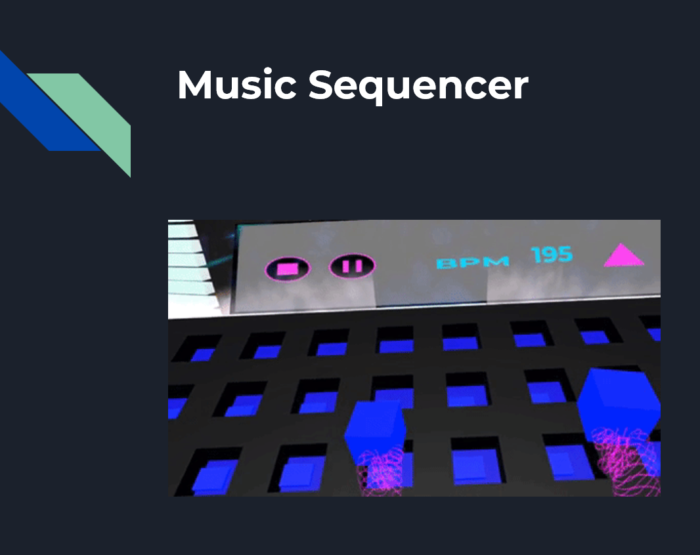
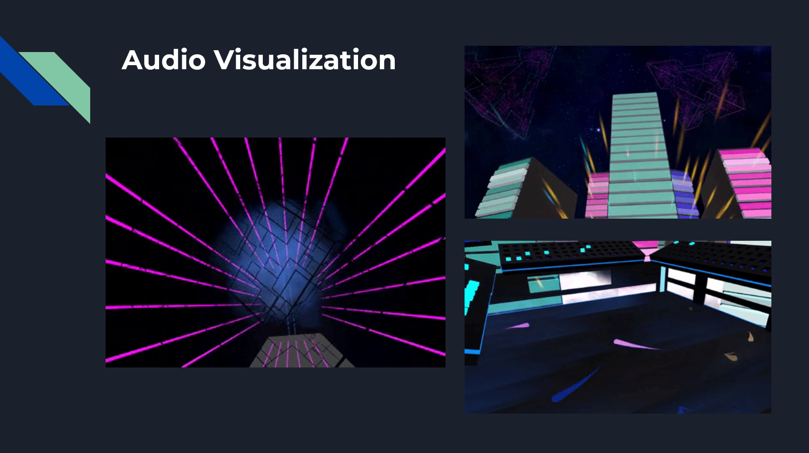
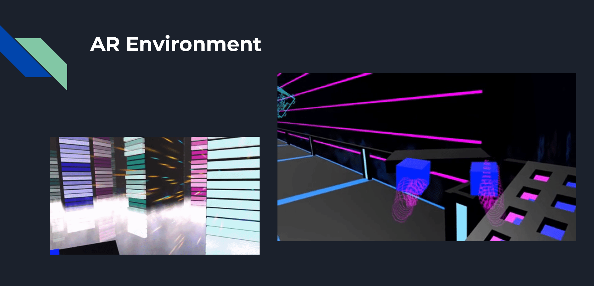

# Voice Scape AR 🎵✨  

Voice Scape AR is an immersive, **voice-driven augmented reality (AR) music experience** built for **Snap Spectacles**. Users can create **synthwave-inspired** music loops through **voice commands**, while **neon fractals and reactive visuals** dynamically appear in their real-world space. This hands-free approach allows for **real-time music visualization**, making **music creation more accessible and intuitive**.

## 🚀 Project Overview  

- **Core Innovation**: Hands-free **voice-controlled** music sequencer in AR.
- **Key Features**:  
  - **Voice Commands** to create and modify music.  
  - **FFT-based Real-Time Audio Visualization** (responsive fractals, neon animations).  
  - **Procedural Visuals** that evolve with user-generated soundscapes.  
  - **Spectacles Integration** for **spatially-aware music creation**.  
  - **Short & Replayable Sessions** (~10–15 minutes per play).  
  - **Unlockable loops, fractal styles, and shareable clips** for engagement.  

🎨 **Live Demo**: [Voice Scape AR Mockup](https://team-sound-escape.github.io/Voice-Scape-AR/)  

---

## 📌 How It Works  

### 🔊 Voice-Driven Interaction  

Users **speak commands** to control the experience:  
- 🎵 **"Add Bassline"** → Introduces a synth bass layer.  
- 🥁 **"Change Drums"** → Replaces drum loops.  
- 🌌 **"Grow Fractals"** → Expands neon visuals.  
- 🎨 **"Change Colors"** → Alters the AR environment’s color palette.  

### 🎶 Real-Time Audio Visualization  

- **FFT-based** sound analysis maps music frequency to **fractal animations**.  
- **Neon fractals evolve dynamically**, reacting to **volume, beat intensity, and frequency range**.  
- **AR elements anchor in space**, enhancing immersion.  

---

## 📍 User Flow  

1️⃣ **Lens Launch & Tutorial** (0–1 min)  
   - Quick guide explains **voice commands**.  
   - Users **select a starter synth loop** to begin creating.  

2️⃣ **Music Creation & Visual Expansion** (2–10 min)  
   - Users **layer tracks, change loops, and modify visuals** through voice.  
   - **Audio-reactive fractals and neon lights evolve dynamically** in AR.  

3️⃣ **Session Wrap-Up & Sharing** (10–12 min)  
   - Users see a **snapshot** of their final visual creation.  
   - Option to **save a clip** or **share via Snap**.  

4️⃣ **Replay & Retention Hooks** (12–15 min)  
   - Unlock **new color themes, sound loops, fractal effects** by returning for future sessions.  

---

## 🎮 Features & Technical Stack  

| Feature | Tech Used |
|---------|-----------|
| **Voice Interaction** | Lens Studio Voice Commands API |
| **Audio Visualization** | FFT-based sound processing |
| **Neon Fractal Effects** | GPU-optimized shaders for real-time fractal growth |
| **World Mesh Tracking** | AR anchoring for immersive spatial interaction |
| **Replayable Experience** | Unlockable loops, fractal styles, shareable AR music |

---

## 📸 Screenshots & Visuals  

### 🎛 Music Sequencer  
Users interact with a **grid-based music sequencer** in AR.

  

### 🎶 Audio Visualization  
Neon fractals and **dynamic visual effects** respond to music.

  

### 🌌 Immersive Synthwave Environment  
A **synthwave-inspired space** where users compose and visualize music in AR.

  

---

## 📌 Project Status  

- ✅ **Concept Approved** by Snap Inc.'s **Spectacles Accelerator Program**.  
- ✅ **Prototype in Progress** – developing the core **voice-to-visual interaction** loop.  
- 🚧 **Next Steps**:
  - **Improve voice recognition accuracy**.
  - **Expand the music library with additional loops**.
  - **Optimize visuals for real-time AR performance**.
  - **Refine UI & accessibility for seamless hands-free control**.

---

## 👥 Team Sound Escape  

- **Michael Chaves** – *Lead Voice Interaction & UX Designer, Developer*  
- **Sinchana Nama** – *Lens Studio Developer / Scripting Specialist*  
- **Christopher Park** – *3D Asset Creator (Modeling & Animation)*  
- **Paul Reitz** – *Backend Development & Optimization*  

📄 **Project Concept Document**: [Team Sound Escape Initial Concept](docs/Team_Sound_Escape_Initial_Concept.pdf)  

---

## 🎬 Demo & Development  

📢 Want to contribute or test the prototype? **Stay tuned for upcoming builds!**  
🔗 [Live Mockup](https://team-sound-escape.github.io/Voice-Scape-AR/)  

### 📌 Requirements  

- Snap **Spectacles 2025** (Required for AR integration).  
- **Lens Studio** for local testing.  
- **Microphone access** for voice interactions.  

---

## 💡 Future Plans  

🔹 **Extended Voice Controls** – More detailed music production tools.  
🔹 **Multiplayer Collaboration** – Real-time jam sessions with others.  
🔹 **Custom Sound Packs** – User-generated sound banks for personalized experiences.  

🎵 **Join us in redefining AR music!**  

---

## 📜 License  

MIT License – Feel free to modify and expand upon the project!  

---

📢 **For questions, collabs, or feedback, contact us at [GitHub Issues](https://github.com/team-sound-escape/Voice-Scape-AR/issues)**.  

🚀 *Let’s make AR music creation more immersive and accessible!* 🚀
